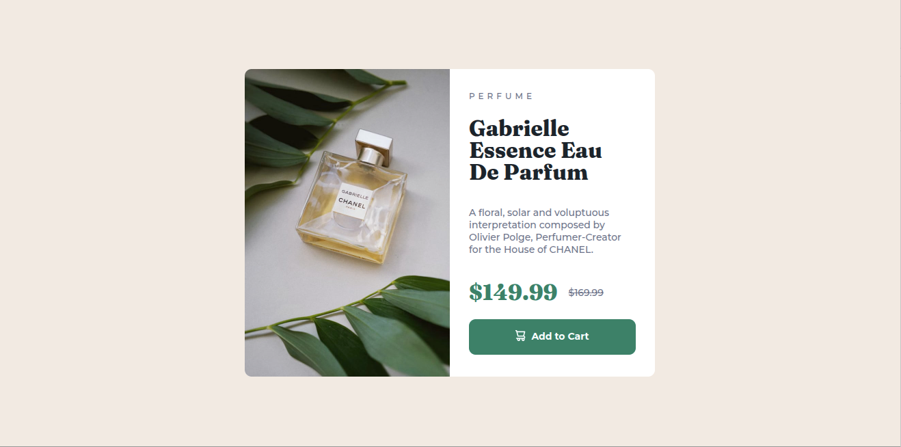

# Frontend Mentor - Product preview card component solution

This is a solution to the [Product preview card component challenge on Frontend Mentor](https://www.frontendmentor.io/challenges/product-preview-card-component-GO7UmttRfa). Frontend Mentor challenges help you improve your coding skills by building realistic projects. 

## Table of contents

- [Overview](#overview)
  - [The challenge](#the-challenge)
  - [Screenshot](#screenshot)
  - [Links](#links)
- [My process](#my-process)
  - [Built with](#built-with)
  - [What I learned](#what-i-learned)
  - [Useful resources](#useful-resources)
- [Author](#author)

## Overview

### The challenge

Users should be able to:

- View the optimal layout depending on their device's screen size
- See hover and focus states for interactive elements

### Screenshot



### Links

- Solution URL: [Add solution URL here](https://your-solution-url.com)
- Live Site URL: [Add live site URL here](https://your-live-site-url.com)

## My process

### Built with

- Semantic HTML5 markup
- CSS custom properties
- Flexbox
- CSS Grid
- Mobile-first workflow

**Note: These are just examples. Delete this note and replace the list above with your own choices**

### What I learned

I learned to use the property max-inline-size: 100%, to avoid image exceeds his parent limits.

```html
    max-inline-size: 100%;
    block-size: auto;
```
Picture tag to dictate which image source should be taken based on a media query

```css
      <picture>
        <source srcset="./images/image-product-desktop.jpg" media="(min-width: 375px)">
        
      </picture>

```
### Useful resources

- [Limit images to their parent container sizes](https://web.dev/learn/design/responsive-images?continue=https%3A%2F%2Fweb.dev%2Flearn%2Fdesign&hl=es-419#constrain) 
- [Image sources](https://web.dev/learn/design/picture-element?continue=https%3A%2F%2Fweb.dev%2Flearn%2Fdesign&hl=es-419#image_sizes) 

## Author

- Frontend Mentor - [@melbita](https://www.frontendmentor.io/profile/melbita)
